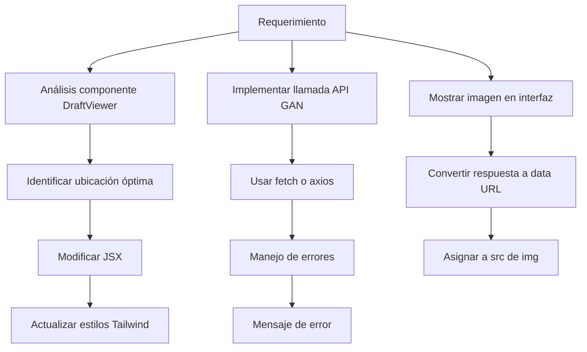

## Plan para integrar imágenes GAN en el visor de documentos

### Diagrama de flujo



### Pasos detallados:

1. **Modificar `DraftViewer.jsx`**:
   - Añadir contenedor para la imagen debajo del visor principal
   - Implementar estado para almacenar la imagen
   - Añadir lógica de carga usando `useEffect`

2. **Implementar llamada API**:
   ```javascript
   fetch('/proxy/gan/generate') // Usar proxy para evitar CORS
     .then(response => response.blob())
     .then(blob => {
       const reader = new FileReader();
       reader.onloadend = () => setImageSrc(reader.result);
       reader.readAsDataURL(blob);
     })
   ```

3. **Actualizar proxy.js**:
   - Añadir ruta para redirigir /proxy/gan → http://localhost:8000

4. **Estilos con Tailwind**:
   - Añadir clases para contenedor de imagen: `mt-4 p-2 border rounded-lg shadow`
   - Estilo para imagen: `max-w-full h-auto`

5. **Manejo de errores**:
   - Mostrar mensaje si falla la carga
   - Implementar reintento opcional

### Archivos a modificar:
1. `src/components/DraftViewer.jsx`
2. `proxy.js` (para configurar proxy de la GAN)
3. `src/index.css` (opcional, si se necesitan estilos adicionales)